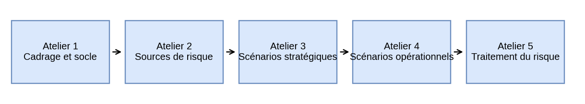
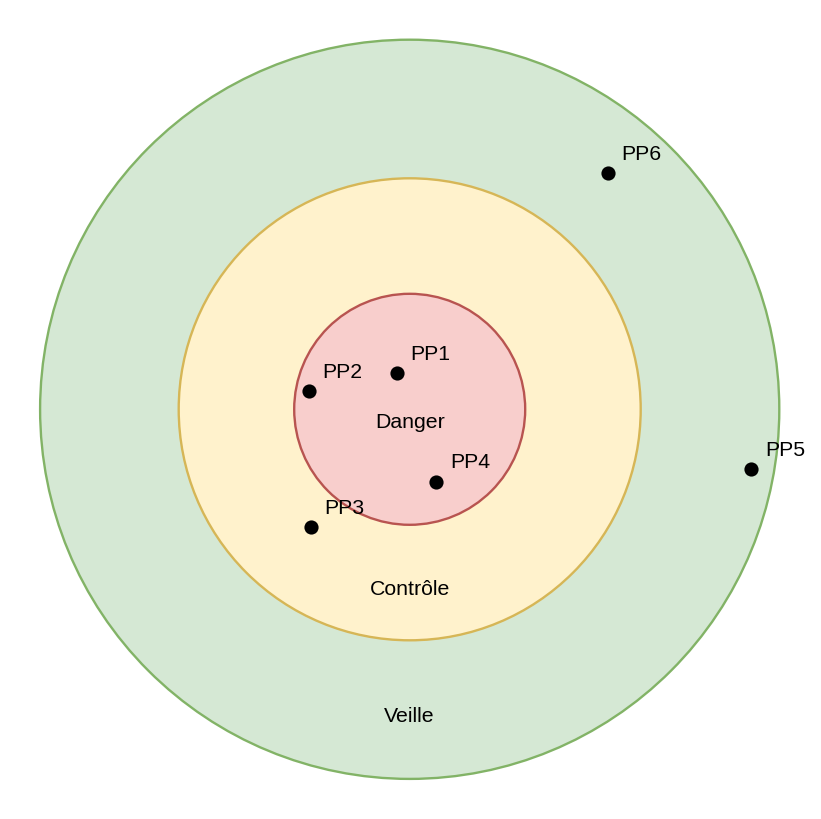
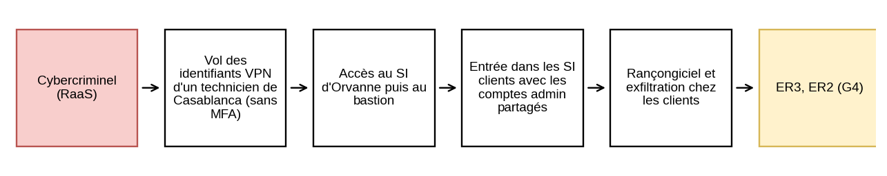
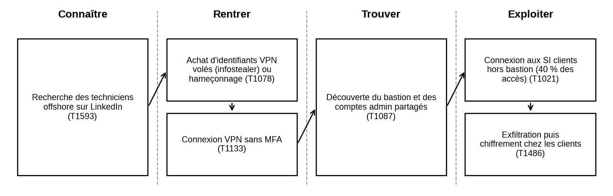
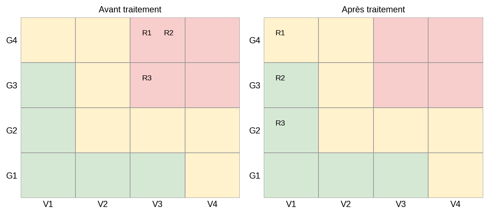

# # Analyse de risques EBIOS RM sur une ESN fictive

Projet personnel d'entraînement : appliquer les 5 ateliers de la méthode **EBIOS Risk Manager** de l'ANSSI sur une entreprise fictive, Orvanne Group, une ESN de 4 800 personnes répartie sur plusieurs sites.

> Le contexte de l'entreprise (nom, chiffres, sites, incidents) est fictif et a été généré avec l'aide d'une IA pour servir de terrain d'étude. L'analyse de risques est un travail personnel.

## Sommaire

1. [Contexte de l'entreprise](#1-contexte-de-lentreprise)
2. [Méthode et échelles](#2-méthode-et-échelles)
3. [Atelier 1 – Cadrage et socle](#3-atelier-1--cadrage-et-socle)
4. [Atelier 2 – Sources de risque](#4-atelier-2--sources-de-risque)
5. [Atelier 3 – Scénarios stratégiques](#5-atelier-3--scénarios-stratégiques)
6. [Atelier 4 – Scénario opérationnel](#6-atelier-4--scénario-opérationnel)
7. [Atelier 5 – Traitement du risque](#7-atelier-5--traitement-du-risque)
8. [Conclusion](#8-conclusion)

---

## 1. Contexte de l'entreprise

Orvanne Group est une ESN française (conseil, intégration, services managés, SOC managé). Elle compte 5 sites en France et 2 centres de services à Porto et Casablanca. Ses clients sont sensibles : banque, défense, énergie. Son SI est hybride, avec un Active Directory au siège, Microsoft 365 et Azure.

📄 **Dossier complet de l'entreprise :** [Orvanne_dossier_entreprise.pdf](docs/Orvanne_dossier_entreprise.pdf) (identité, sites, SI, prestataires, conformité, incidents récents).

---

## 2. Méthode et échelles

EBIOS RM part des enjeux métier de l'entreprise, puis se met à la place de l'attaquant pour construire des scénarios réalistes. La méthode se déroule en 5 ateliers.

Échelles utilisées pour toute l'étude :

| Niveau | Gravité | Vraisemblance |
|---|---|---|
| 1 | Mineure | Peu vraisemblable |
| 2 | Significative | Vraisemblable |
| 3 | Grave | Très vraisemblable |
| 4 | Critique | Quasi certain |

**Niveau de risque = Gravité × Vraisemblance.** Score ≥ 9 : inacceptable. Score de 4 à 8 : tolérable sous contrôle. Score ≤ 3 : acceptable.

---

## 3. Atelier 1 – Cadrage et socle

**Périmètre :** le groupe en France et ses services managés. La zone défense de Toulouse et le SI interne des centres offshore sont exclus.

**Valeurs métier** (ce qui compte pour l'entreprise) :

| ID | Valeur métier | Nature |
|---|---|---|
| VM1 | Réalisation des projets clients | Processus |
| VM2 | Services managés et SOC managé 24/7 | Processus |
| VM3 | Données et code source confiés par les clients | Information |

**Biens supports** (ce sur quoi elles reposent) :

| ID | Bien support | Valeurs métier |
|---|---|---|
| BS1 | Active Directory et Entra ID | VM1, VM2, VM3 |
| BS2 | VPN et bastion d'administration | VM2, VM3 |
| BS3 | Microsoft 365 et forges Git | VM1, VM3 |
| BS4 | Sauvegardes Azure | VM1, VM2, VM3 |
| BS5 | Collaborateurs, freelances, centres offshore | VM1, VM2, VM3 |

**Événements redoutés :**

| ID | VM | Événement redouté | Gravité |
|---|---|---|---|
| ER1 | VM3 | Fuite de données ou de code source clients | G4 |
| ER2 | VM2 | Services managés indisponibles plus de 24 h | G4 |
| ER3 | VM2 | Compromission des SI clients via les accès d'Orvanne | G4 |
| ER4 | VM1 | Projets à l'arrêt plus d'une semaine | G3 |

**Principaux écarts au socle de sécurité :**

- Pas de MFA sur le VPN des centres offshore
- Bastion couvrant seulement 60 % des accès admin, avec des comptes partagés
- 340 comptes de service AD jamais revus
- Sauvegardes dans le même tenant Azure que la production

---

## 4. Atelier 2 – Sources de risque

On identifie qui pourrait attaquer et dans quel but, puis on garde les couples les plus pertinents.

| Couple | Source de risque | Objectif visé | Retenu |
|---|---|---|---|
| SR1/OV1 | Cybercriminel (RaaS) | Rançonner Orvanne en paralysant son SI | ✅ |
| SR1/OV2 | Cybercriminel (RaaS) | Rebondir sur les clients pour les rançonner | ✅ |
| SR2/OV3 | Freelance malveillant | Emporter des données clients | ✅ |
| SR3/OV4 | Attaquant étatique | Espionner les clients défense | ❌ |
| SR4/OV5 | Hacktiviste | Nuire à l'image d'Orvanne | ❌ |

L'attaquant étatique vise surtout la zone défense, hors périmètre. Le hacktiviste n'a qu'un impact d'image.

---

## 5. Atelier 3 – Scénarios stratégiques

On évalue d'abord la menace que représente chaque partie prenante de l'écosystème :

**Menace = (Dépendance × Pénétration) / (Maturité × Confiance)**

| ID | Partie prenante | Dép. | Pén. | Mat. | Conf. | Menace | Zone |
|---|---|---|---|---|---|---|---|
| PP1 | Freelances et sous-traitants | 3 | 4 | 1 | 2 | 6.00 | 🔴 Danger |
| PP2 | Centre de services Casablanca | 3 | 3 | 2 | 2 | 2.25 | 🔴 Danger |
| PP3 | Centre de services Porto | 3 | 3 | 2 | 3 | 1.50 | 🟡 Contrôle |
| PP4 | Maintenance badges et vidéo | 2 | 3 | 1 | 2 | 3.00 | 🔴 Danger |
| PP5 | Clients (comptes invités) | 2 | 2 | 2 | 3 | 0.67 | 🟢 Veille |
| PP6 | Azure et Microsoft 365 | 4 | 3 | 4 | 4 | 0.75 | 🟢 Veille |

Plus une partie prenante est proche du centre, plus elle est dangereuse :

Trois scénarios stratégiques en découlent :

| ID | Source | Scénario | ER atteints | Gravité |
|---|---|---|---|---|
| SS1 | SR1/OV2 | Rebond vers les clients via un technicien offshore | ER3, ER2 | G4 |
| SS2 | SR1/OV1 | Rançongiciel sur le SI d'Orvanne | ER2, ER4, ER1 | G4 |
| SS3 | SR2/OV3 | Exfiltration par un freelance en fin de mission | ER1 | G3 |

Chemin d'attaque du scénario le plus critique, SS1 :

---

## 6. Atelier 4 – Scénario opérationnel

On détaille techniquement SS1, étape par étape, en rangeant les actions en 4 phases et en les reliant à MITRE ATT&CK.

| # | Phase | Action | Technique | Difficulté |
|---|---|---|---|---|
| 1 | Connaître | Recherche des techniciens offshore sur LinkedIn | T1593 | 1 |
| 2 | Rentrer | Achat d'identifiants VPN volés ou hameçonnage | T1078 | 2 |
| 3 | Rentrer | Connexion VPN sans MFA | T1133 | 1 |
| 4 | Trouver | Découverte du bastion et des comptes admin partagés | T1087 | 2 |
| 5 | Exploiter | Connexion aux SI clients hors bastion | T1021 | 2 |
| 6 | Exploiter | Exfiltration puis chiffrement chez les clients | T1486 | 2 |

Aucune étape n'est difficile : le VPN sans MFA et les comptes admin partagés ouvrent la voie. **Vraisemblance : V3.** Même raisonnement pour SS2 (hameçonnage puis Kerberoasting) et SS3 (compte non désactivé), aussi cotés V3.

---

## 7. Atelier 5 – Traitement du risque

| ID | Risque | Initial | Niveau initial | Mesures | Résiduel | Niveau résiduel |
|---|---|---|---|---|---|---|
| R1 | Rebond vers les clients via l'offshore | G4 V3 | 🔴 Inacceptable | M1, M2, M5 | G4 V1 | 🟡 Tolérable |
| R2 | Rançongiciel sur le SI d'Orvanne | G4 V3 | 🔴 Inacceptable | M1, M3, M4, M5 | G3 V1 | 🟢 Acceptable |
| R3 | Exfiltration par un freelance | G3 V3 | 🔴 Inacceptable | M1, M6, M7 | G2 V1 | 🟢 Acceptable |

Position des risques avant et après le plan d'action :

**Plan d'action :**

| ID | Mesure | Risques | Responsable | Échéance |
|---|---|---|---|---|
| M1 | MFA sur tous les accès distants (offshore, freelances) | R1, R2, R3 | DSI | T4 2026 |
| M2 | Bastion obligatoire, comptes admin nominatifs | R1 | Dir. services managés | T1 2027 |
| M3 | Revue des comptes de service AD | R2 | DSI | T1 2027 |
| M4 | Sauvegardes immuables hors tenant, tests de restauration | R2 | DSI | T1 2027 |
| M5 | Supervision EDR 24/7 avec règles de détection dédiées | R1, R2 | RSSI | T2 2027 |
| M6 | Désactivation automatique des comptes en fin de mission | R3 | DRH + DSI | T4 2026 |
| M7 | Restriction du partage externe SharePoint | R3 | DSI | T1 2027 |

---

## 8. Conclusion

- Les 3 risques sont inacceptables au départ ; après le plan d'action, aucun ne l'est plus.
- R1 reste en G4 : les mesures réduisent la probabilité, pas l'impact d'une attaque sur les clients. Il doit être accepté formellement par la direction.
- Les mesures les plus efficaces (MFA, désactivation des comptes) sont aussi les moins coûteuses.

**Ce que ce projet m'a appris :** relier des faiblesses techniques concrètes (MFA absent, comptes partagés) à des risques métier, et comprendre que l'écosystème (prestataires, sous-traitants) est souvent le maillon faible.

## Sources

- ANSSI, *La méthode EBIOS Risk Manager – Le guide* (cyber.gouv.fr)
- MITRE ATT&CK (attack.mitre.org)
